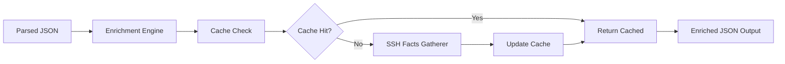

# rustle-facts

Architecture detection tool for Rustle - a high-performance modular reimplementation of Ansible in Rust. This tool enriches parsed Ansible playbook data with target host architecture and OS information for cross-compilation decisions.

## 🎯 Overview

`rustle-facts` is a critical component in the Rustle pipeline that bridges parsed Ansible playbooks with execution planning:

```
rustle-parse → rustle-facts → rustle-plan → rustle-deploy/exec
```

Unlike Ansible's full fact gathering, rustle-facts performs minimal SSH operations to collect only essential information needed for cross-compilation and execution planning.

## 🚀 Quick Start

1. **Installation**
   ```bash
   cargo install --path .
   ```

2. **Basic Usage**
   ```bash
   # Process parsed playbook data
   rustle-parse playbook.yml | rustle-facts | rustle-plan
   
   # With custom parallelism
   rustle-parse playbook.yml | rustle-facts --parallelism 50
   
   # With verbose logging
   RUST_LOG=debug rustle-facts < parsed_playbook.json
   ```

3. **Example Pipeline**
   ```bash
   # Full Rustle pipeline example
   cat inventory.yml playbook.yml | \
     rustle-parse | \
     rustle-facts | \
     rustle-plan | \
     rustle-exec
   ```

## ✨ Features

- **Stream Processing**: Accepts parsed JSON from stdin and outputs enriched JSON to stdout
- **Intelligent Caching**: Persistent cache of architecture facts with configurable TTL
- **Parallel Processing**: Handles multiple hosts concurrently (default: 20 connections)
- **Local Host Detection**: Automatically detects localhost and uses direct system detection
- **Graceful Fallbacks**: Provides fallback facts when hosts are unreachable
- **Performance Optimized**: Completes fact gathering for 100 hosts in under 5 seconds

## 📦 What Facts Are Gathered

`rustle-facts` collects minimal but essential information:

- **Architecture**: x86_64, aarch64, arm64, etc.
- **Operating System**: Linux, Darwin, Windows
- **OS Family**: RedHat, Debian, Alpine, etc.
- **Distribution**: Ubuntu, CentOS, Fedora, etc.
- **Distribution Version**: 22.04, 8.5, etc.

## 📁 Project Structure

```
rustle-facts/
├── src/
│   ├── main.rs            # CLI entry point
│   ├── enrichment.rs      # Core enrichment logic
│   ├── ssh_facts.rs       # SSH-based fact gathering
│   ├── cache.rs           # Caching implementation
│   ├── types.rs           # Shared type definitions
│   ├── config.rs          # Configuration handling
│   └── error.rs           # Error types
├── tests/                 # Integration tests
├── docs/                  # Documentation
│   └── spec/             # Specifications
├── examples/             # Example JSON files
├── .gitignore            # Git ignore rules
├── CLAUDE.md             # Claude Code guidelines
├── Cargo.toml            # Project manifest
└── README.md             # This file
```

## 🛠️ Development

### Building
```bash
# Debug build
cargo build

# Release build
cargo build --release

# Run tests
cargo test

# Run with example data
cargo run < examples/file_operations.json
```

### Code Quality
```bash
# Format code
cargo fmt

# Run linter
cargo clippy -- -D warnings

# Check without building
cargo check

# Run security audit
cargo audit
```

### Testing with Real Data
```bash
# Test with localhost
echo '{"inventory": {"all": {"hosts": {"localhost": {}}}}, "plays": []}' | cargo run

# Test with remote hosts
rustle-parse inventory.yml playbook.yml | cargo run

# Test with custom configuration
RUSTLE_FACTS_CACHE_TTL=3600 cargo run < parsed_data.json
```

## ⚙️ Configuration

### Environment Variables

```bash
# Logging level
RUST_LOG=info

# Cache configuration
RUSTLE_FACTS_CACHE_TTL=1800        # Cache TTL in seconds (default: 30 minutes)
RUSTLE_FACTS_CACHE_DIR=~/.cache    # Cache directory location

# Connection settings
RUSTLE_FACTS_PARALLELISM=20        # Max concurrent SSH connections
RUSTLE_FACTS_TIMEOUT=10            # SSH connection timeout in seconds
```

### Command Line Options

```bash
rustle-facts --help

Options:
  -p, --parallelism <N>    Maximum parallel SSH connections [default: 20]
  -v, --verbose            Enable verbose logging
  -h, --help               Print help
  -V, --version            Print version
```

## 📊 Performance

`rustle-facts` is designed for high performance:

- **100 hosts**: < 5 seconds
- **1000 hosts**: < 30 seconds (with default parallelism)
- **Cache hits**: < 100ms for any number of hosts

### Performance Tuning

```bash
# Increase parallelism for large deployments
rustle-facts --parallelism 100

# Use release build for production
cargo build --release

# Enable CPU-specific optimizations
RUSTFLAGS="-C target-cpu=native" cargo build --release
```

## 🔍 Troubleshooting

### Common Issues

1. **SSH Connection Failures**
   ```bash
   # Check SSH connectivity
   ssh user@host "uname -a"
   
   # Increase timeout for slow connections
   RUSTLE_FACTS_TIMEOUT=30 rustle-facts
   ```

2. **Cache Issues**
   ```bash
   # Clear cache
   rm -rf ~/.cache/rustle-facts
   
   # Disable cache temporarily
   RUSTLE_FACTS_CACHE_TTL=0 rustle-facts
   ```

3. **Performance Problems**
   ```bash
   # Enable debug logging
   RUST_LOG=debug rustle-facts
   
   # Check for bottlenecks
   RUST_LOG=trace rustle-facts 2>&1 | grep "SSH operation"
   ```

## 🏗️ Architecture

`rustle-facts` follows a modular architecture:



## 🤝 Integration with Rustle Ecosystem

### Input Format

Expects JSON from `rustle-parse`:

```json
{
  "inventory": {
    "all": {
      "hosts": {
        "web1": {"ansible_host": "192.168.1.10"},
        "db1": {"ansible_host": "192.168.1.20"}
      }
    }
  },
  "plays": [...]
}
```

### Output Format

Produces enriched JSON for `rustle-plan`:

```json
{
  "inventory": {
    "all": {
      "hosts": {
        "web1": {
          "ansible_host": "192.168.1.10",
          "ansible_architecture": "x86_64",
          "ansible_os_family": "Debian",
          "ansible_distribution": "Ubuntu"
        }
      }
    }
  },
  "plays": [...]
}
```

## 📝 License

Part of the Rustle project. See LICENSE for details.

## 🔗 Related Projects

- [rustle-parse](https://github.com/iepathos/rustle-parse) - YAML parser for Ansible playbooks
- [rustle-plan](https://github.com/iepathos/rustle-plan) - Execution planner
- [rustle-exec](https://github.com/iepathos/rustle-exec) - Task executor
- [rustle-deploy](https://github.com/iepathos/rustle-deploy) - Deployment engine